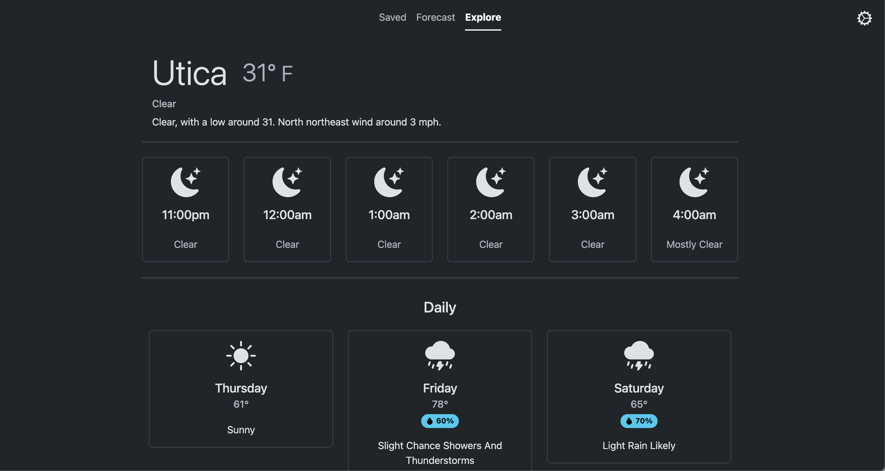

# Weather App

Simple Vue app utilizing the [National Weather Service API](https://www.weather.gov/documentation/services-web-api), Mapbox's [Geocoding API](https://docs.mapbox.com/api/search/geocoding/#forward-geocoding-with-search-text-input), and [Bootstrap](https://getbootstrap.com/) to
provide an intuitive and full-featured UX across all screen-sizes.

### Local Development

- ##### [Install NVM](https://github.com/nvm-sh/nvm?tab=readme-ov-file#installing-and-updating) (recommended)
- ##### Install Node 23: `nvm install 23 && nvm use 23`
- ##### Install Dependencies: `npm ci`
- ##### Get API up and running: [instructions](https://github.com/gregriff/weather-api?tab=readme-ov-file#weather-api)
- ##### Create env file: `echo 'VITE_API_BASE_URL="http://localhost:8000/v1"' > .env`
- ##### Run dev server: `npm run dev`

### Roadmap

- Optional OIDC login system with Keycloak
- Manual containerized deployment with nginx, hosted by Cloudflare Tunnels
